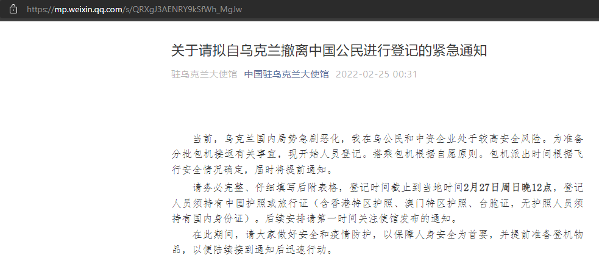
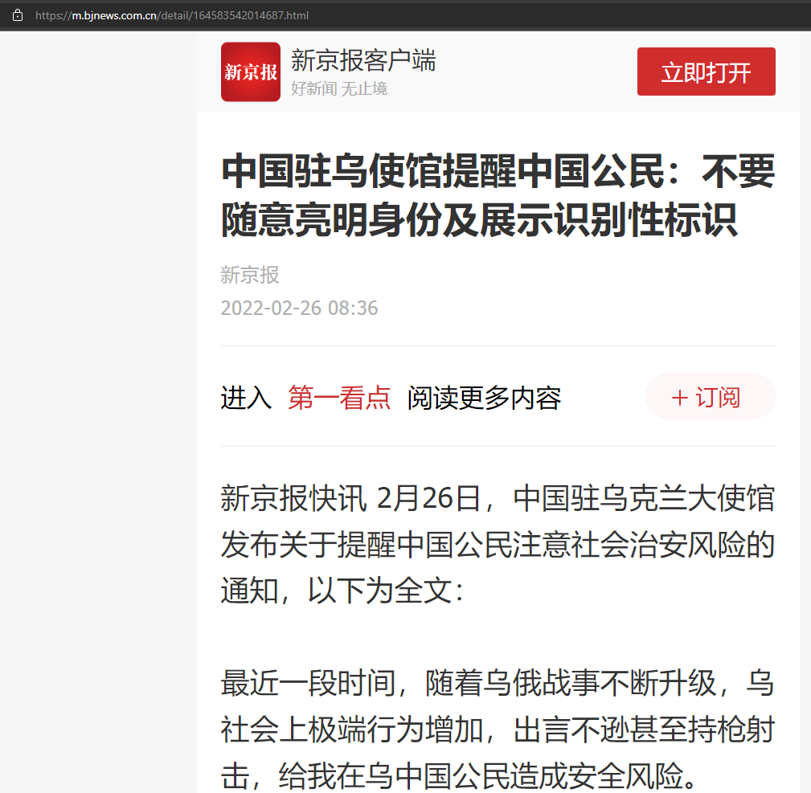
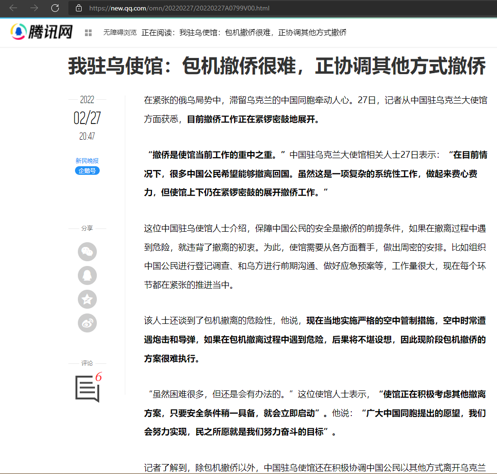

总路线

- 2022.02.11
[防疫要紧](https://mp.weixin.qq.com/s/k55xW8jHH9Xizof4k0BNWg)

- 2022.02.13
[美国带头 多国呼吁公民从乌撤离](https://j.021east.com/p/1644724183041033)

- 2022.02.16
[[中国新闻]拜登称俄“入侵”乌克兰可能性仍然很大](https://tv.cctv.com/2022/02/16/VIDEILL2gGkPVPMPkoiweeBC220216.shtml?spm=C52507945305.P1Tyk9aHorGZ.0.0)

- 2022.02.17
[乌克兰局势更加扑朔迷离：打还是不打？！](http://www.china.com.cn/opinion2020/2022-02/17/content_78054840.shtml)

- 2022.02.24（26报道）
[中国国旗在基辅脱销，在乌公民用尽各种办法自制国旗 ](https://www.sohu.com/a/525477287_115479)

- 2022.02.25
[关于请拟自乌克兰撤离中国公民进行登记的紧急通知](https://mp.weixin.qq.com/s/QRXgJ3AENRY9kSfWh_MgJw)

- 2022.02.26
[中国驻乌使馆提醒中国公民：不要随意亮明身份及展示识别性标识](https://m.bjnews.com.cn/detail/164583542014687.html)

- 2022.02.27
[我驻乌使馆：包机撤侨很难，正协调其他方式撤侨](https://new.qq.com/omn/20220227/20220227A0799V00.html)

