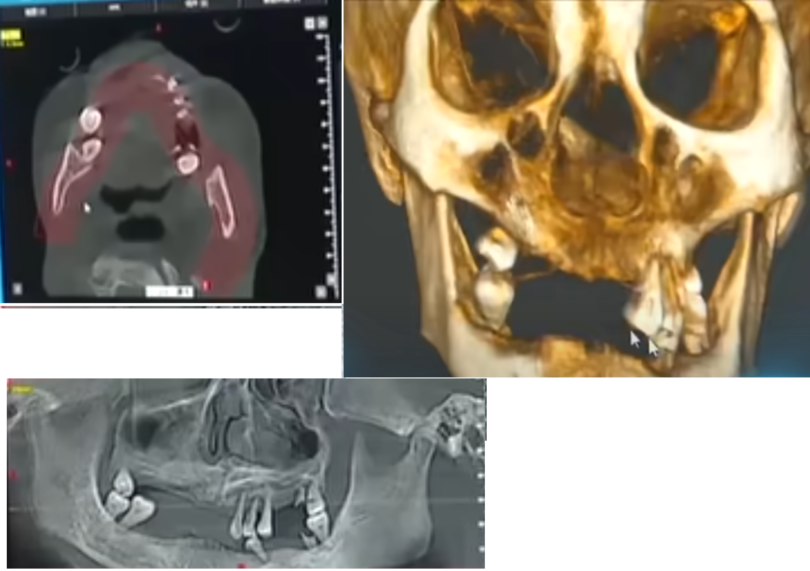

# 八孩

1. 起点：主播“徐州一修哥”于2022年一月底上传了一段影片，介绍徐州丰县一名农民独自抚养着8个孩子，宣称是要传播正能量的影片


2. 起因：影片中，56岁董姓男子声称自己一个人要抚养8个孩子和精神失常的妻子。妻子是一名满脸污垢，被铁链拴住脖子锁在一个连门都没有的破废小房里，当天气温只有0度，孩子母亲身上只穿着一件单薄的毛衣连鞋子都没有，并且只能吃冷掉的食物和馒头。

> 总结一：疑似被拐（特点：非本地人，囚禁，被毒打，无牙齿和舌尖）


3. [官方第一次通报](https://news.sina.com.cn/s/2022-01-30/doc-ikyamrmz8380928.shtml)

> 通报总结：不存在拐卖，女子有技术问题，已进一步核实。

[原文](./第一次回应原文.txt)


4. [官方第二次通报](https://news.sina.com.cn/s/2022-01-30/doc-ikyamrmz8380928.shtml)

> 通报总结：1996.6 走失后被收养，2020.11 DNA 被录入，2021.6 发病且加重，2022.1.30 会诊结果为精神分裂症，自 2014.5 至今，当地政府每年给予补助。

[原文](./第二次回应原文.txt)


5. 网友提供[宝贝回家](https://www.baobeihuijia.com/)官网提供的照片

> 总结：图片和八孩女样貌及其相似，且年龄上接近


6. 通报二发布之后，八孩父依旧为婚庆和装修广告代言


7. [官方第三次通报](http://js.people.com.cn/n2/2022/0207/c360303-35124696.html)

> 总结：① 名为小花梅不是 ```5.``` 中的孩子
       ② 女子父母已故，云南省福贡县亚谷村人，当时被其父母托同村人带到江苏治病后走失，而后未报警未告知其父母
       ③ 牙齿脱落为牙周病导致
       ④ 八个孩子都是她所生

[原文](./第二次回应原文.txt)


8. [官方第四次通报](https://news.sina.com.cn/c/2022-02-10/doc-ikyakumy5258050.shtml)

> 总结：7 中的同村人夫妇均为人贩子且已收监，董某非法拘禁罪被收押

[原文](./第四次回应原文.txt)


9. 两位网友的经历

> 针对徐州市2月7日发布的调查通告称铁链女“杨某侠”是原名“小花梅”的云南人，《云南信息报》前调查记者“铁木”和“马萨”在2022年2月8日至11日来到据称是铁链女的家乡、位于云南福贡县的“亚谷村”实地探访，并与“TM”一同把访谈记录整理成《查找小花梅》并于2月12日在其微信公众号“路的另一边”发表。访谈称，他们从县政府及当地人了解到，“小花梅”确实是亚古村人，并有一个同母异父的光姓妹妹，但无论是该名光姓妹妹，还是邻居和村民，都没有人能辨认出铁链女是徐州市官方通报提到的“小花梅”，唯一指认出来的是一名醉汉；当地村民称，小花梅是傈僳族人，但视频中女子的语言不是傈僳语和怒族语。该份访谈也指出，当地民众都否认曾有官员前往当地调查的说法。《查找小花梅》的原发文稿在两天后从微信公众号中删除。至2月23日，有媒体人在微博透露，指“铁木”和“马萨”两人在发文后被昆明市公安传唤，2月23日下午获释，并被公安要求不能外出、不能受访，亦不能再评论此事

> 2月18日，网名“我能抱起120斤”及“小梦姐姐小拳拳”的2名女性网民在微博连续发文报平安，并披露他们前往丰县探访铁链女一路上的遭遇。据指，两人于2月10日一同前往丰县第二人民医院，希望送花给铁链女，但受到阻挠而无法成事，包括被人抢走手机，其后更收到警方来电警告，被指“发言不正当”；2月11日晚，她们被丰县孙楼派出所“收留”，原因是涉嫌“寻衅滋事”，当晚两人被迫分开，接受高强度的审问和严密监控，期间网民“我能抱起120斤”曾经被民警以电脑外罩紧套头部、险些窒息；2月14日，她们被沛县公安押往徐州看守所，网民“我能抱起120斤”期间曾被便衣人士在警员面前殴打，伤痕遍布头部、颈部及脸部。两名网友数日后被释放，并于2月18日更新微博，网友“小梦姐姐小拳拳”未有交代事迹，只表示要“陪陪家人”，而她的多个平台账号都被封禁。

10. [官方第五次通报](https://news.dayoo.com/society/202202/23/140000_54202278.htm)

> 总结：第四次通报调查全部属实

[原文](./第五次回应原文.txt)


11. 网友质疑内容盘点

> 牙周病不可能只掉前牙，且前门牙牙根未脱落，明显未暴力拔取导致断裂所致(下图为央视新闻视频截取)



> 结婚证上的人明显和八孩母不一致，且结婚证明显不符合国家规定


> 如果结婚证属实，八孩母 1969年出生，八个孩子的出生日期和母亲年龄如下表，确定一个有精神问题的高龄母亲能一直正常生育？且当地政府从未过问还正常为孩子上好户口？

| 序号 | 时间 | 年龄 | 间隔 |
|:--:|:--:|:--:|:--:|
| 1 | 1999.7 | 31 | - |
| 2 | 2011.3 | 43 | 2.9 |
| 3 | 2012.4 | 45 | 1.2 |
| 4 | 2014.11 | 47 | 1.8 |
| 5 | 2016.5 | 49 | - |
| 6 | 2017.5 | 50 | - |
| 7 | 2018.5 | 51 | - |
| 8 | 2020.1 | 53 | - |

> 查找到关于丰县相关离婚诉讼，多个直接提及被拐妇女要求离婚却被驳回，当地政府是否直接承认拐卖结婚的合法性？如果我直接将领带女儿带回家强奸生子并办理结婚证是否也是合法的？为何事发后当地政府要撤回相关的发了文书？

[原文](http://www.zg-zyffw.org.cn/redianhudong/11739.html)


12. 官方后续动作


[赵某与尹某离婚纠纷一审民事判决书](https://wenshu.court.gov.cn/website/wenshu/181107ANFZ0BXSK4/index.html?docId=e5730ce982df4bb3beb2cbe9888d5357)


